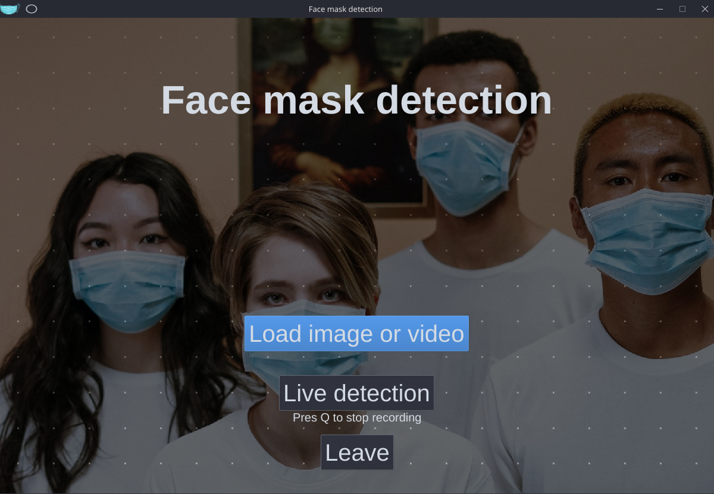
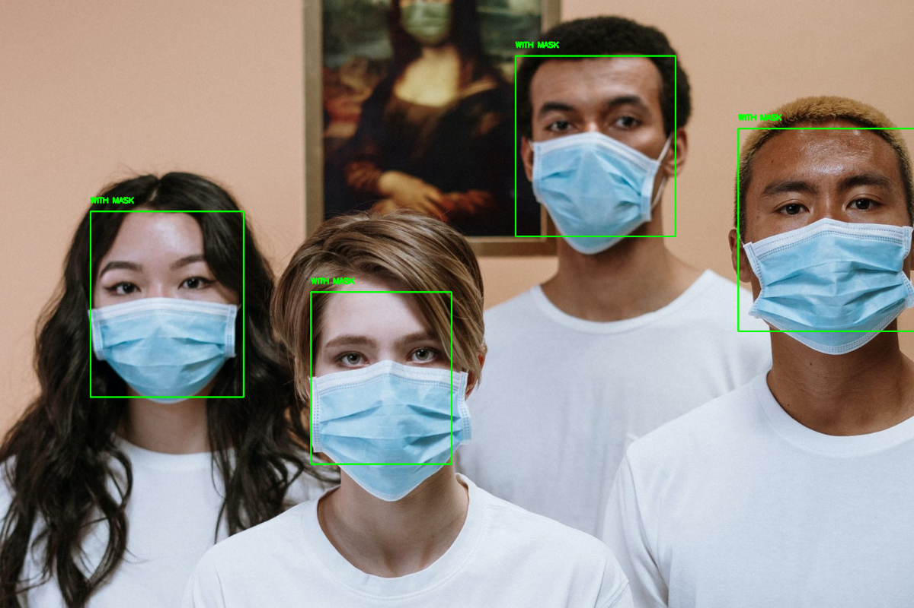

# Face Mask detection

- This project was created as a seminar project on Petnica Summer Institute Machine Learning (**PSI:ML 6**), held in the summer of 2020 (sadly online).

- Basic idea behind this project was to create software which can detect if people on images, videos and live stream have masks on. 

- Research was done by two persons:
    - [Olivera Popović](https://github.com/popovic-olivera)
    - [Vojislav Mladenović](https://github.com/vojaaja)

- Mentors for the project were [Uroš Stegić](https://github.com/uros-stegic) and [Stefan Mojisilović](https://github.com/StefanMojsilovic).

- All of the code was written in Python, using PyTorch framework.

## Screenshots

